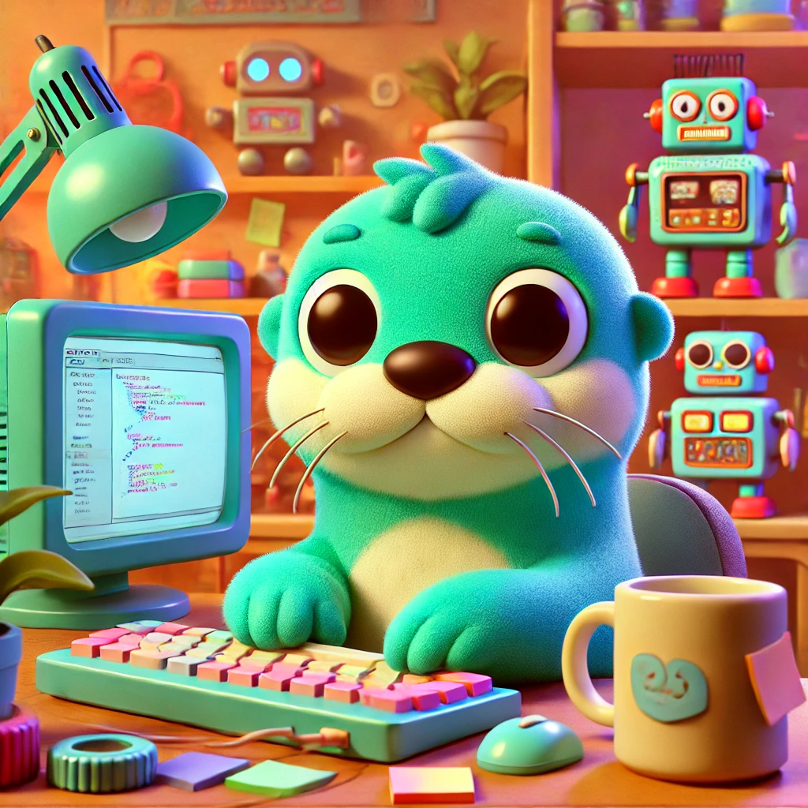

# 8841 OTTER - FRC 2025
### Welcome to the 2025 season!

 

# System Design (TODO: Add information)

## Subsystems 
### Swerve 
- Include wiring diagrams, motor controllers types, CAN Bus IDs, etc.

   
# Notes

## Git (Everyones favorite topic...)

While Git adds a fair bit of initial overhead it provides two important capabilities we need. 
1) Code tracking - This allows us to revert changes to a prior state or more easily identify what might have caused an issue. In code, everything will break eventually; it’s just a matter of time.* 
    - *Breaking and learning is not a failure. Therefore, I will gladly award a prize for the best code-breaking bug that is created (not on purpose) and/or fixed. Although, I’m not yet sure how I plan to define "best." 
2) Parallel edits - Git enables multiple people to make changes to their own copy of a single code base. Then join (merge) the changes into a main (main) code base.  

### General Usage

There are many detailed tutorials online, many with better and more in-depth directions. However, I tried to provide a simple reference below. 

Note: Credential management instructions are omitted for now

#### On first setup run
> git clone https://github.com/Team-8841/FRC-2025.git

Steps 3 and 4 below are regularly repeated multiple times prior to a merge and push back to the GitHub repo.

|Step|Command|Reason|
|-|-|-|
|1|git pull| Updates local copy of GitHub repo with files in GitHub|
|2|git branch \<branch name\>| Creates a local branch for a changes or a feature to be implemented (e.g. Adding Swerve Drive)|
|3|git checkout \<branch name\>| Switches to named branch|
|3|git add .| Causes Git to track changes to all files in directory|
|4|git commit -m "\<*Message*\>"| This will cause all changes to be staged locally. It also provides points in time the code can be restored too. Thus, adding the commit message is very important and helpful in the future. Multiple commits can be made prior to merging a branch with the GitHub repo.|
|5|git merge \<branch name\>|Applies the changes contained in the named branch to the current branch (normally main)|
|6|git push| Updates the copy of code on GitHub with local copy. Should be done rarely|

